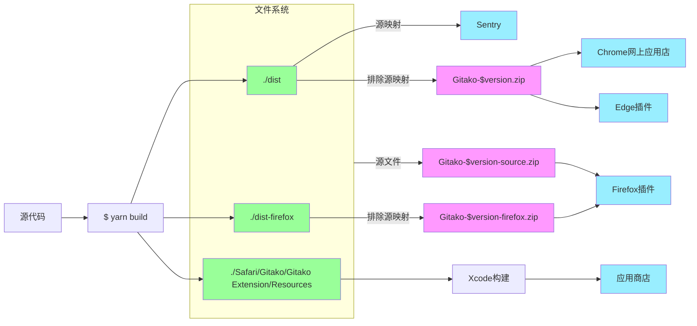

# 贡献

如果您正在尝试贡献，非常感谢！

注意：如果您使用的是Windows，您可能需要为`make`命令寻找替代方案。或者使用WSL。我没有在Windows上测试过开发，不能保证它是否有效。

## 设置开发环境

1. 克隆仓库
2. 运行`make pull-icons`来安装依赖
3. 运行`yarn`来安装依赖
4. 运行`yarn dev`启动开发服务器，您将在项目的根目录下看到一个`dist`文件夹
5. 打开Chrome的扩展页面，启用开发者模式，并从`dist`文件夹加载扩展
6. 导航到您选择的仓库，您应该能看到扩展出现

当您修改源代码时，您需要做以下任一操作来应用您的更改：

- （推荐）使用[Extension Reloader扩展](https://chrome.google.com/webstore/detail/fimgfedafeadlieiabdeeaodndnlbhid)。它可以重新加载所有扩展然后刷新页面（您需要在其设置中启用它）。
- 手动在`chrome://extensions`中重新加载扩展，然后刷新您的仓库页面

## 在其他浏览器中开发

Gitako支持Chrome、Edge、Firefox和Safari。您可以通过遵循以下说明在其他浏览器中开发。

### Edge：

1. 完成“设置开发环境”中的步骤到`yarn dev`
2. 打开Edge的扩展页面，启用开发者模式，并从`dist`文件夹加载扩展
3. 导航到您选择的仓库，您应该能看到扩展出现

### Firefox：

1. 运行`yarn dev`
   这将使用特殊的Firefox配置构建Gitako
2. 运行`yarn debug-firefox`
   一个新的Firefox实例将打开，Gitako自动安装
3. 导航到GitHub仓库，您应该能看到扩展出现
   如果没有，请单击工具栏中的扩展图标并在其子菜单中启用Gitako
4. 当您修改源代码时，最好刷新标签页

### Safari（仅限macOS）：

1. 运行`yarn dev`
2. 在Xcode中打开`Safari/Gitako/Gitako.xcodeproj`
3. 单击“运行”按钮
4. 在Safari的首选项中启用开发者模式
5. 在Safari的首选项中启用Gitako
6. 打开Safari标签页，访问GitHub仓库，然后通过地址栏旁边的Gitako图标激活Gitako
7. 当您修改源代码时，单击Xcode中的“运行”按钮并刷新标签页

## 为生产构建

运行`make release`来构建和发布扩展

